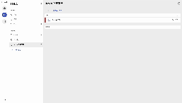

# Jarvis (Flow Assistant)

Jarvis is a productivity tool designed to seamlessly connect todos and notes.
By linking these elements, users can build a more organized and efficient workflow without losing context.

Jarvis는 투두와 노트를 유기적으로 연결하여 원활한 작업 환경을 제공하는 생산성 도구입니다.
각 요소 간 연결을 통해 맥락을 유지한 효율적인 작업 흐름을 지원합니다.

A modular productivity assistant built with React and structured with Feature-Sliced Design (FSD) architecture.
Designed to manage your tasks and notes — with future-ready backend extensibility.

🧠 Inspired by the concept of a smart personal assistant like Iron Man’s J.A.R.V.I.S.

React 기반으로 개발되었으며, Feature-Sliced Design(FSD) 아키텍처를 적용한 모듈형 생산성 도우미입니다.
투두와 노트를 효율적으로 관리할 수 있도록 설계되었으며, 향후 백엔드 확장도 고려해 구조화되었습니다.
🧠 이 프로젝트는 아이언맨의 스마트 비서 **J.A.R.V.I.S.**에서 영감을 받았습니다.

---




## ✨ Features

- 🗓️ **Schedule Management**  
  Drag-and-drop interface for managing daily, weekly, and monthly plans.

- ✅ **TODO with Category Support**  
  Sort and organize tasks under user-defined categories.

- 🧠 **Note Linking**  
  Connect related notes to tasks or events for better context.

- 🧩 **FSD Architecture**  
  Domain-based modular code separation for large-scale maintainability.

- 🧪 **Mocked Backend Simulation**  
  `/backend` folder mirrors **Java Spring Boot** architecture, preparing for seamless backend integration.

- 📱 **PWA Support (Progressive Web App)**  
  Installable on desktop/mobile. Works offline with persistent local data.

---

## 🏗 Project Structure

### 📁 Frontend (Feature-Sliced Design)

<pre><code>src/
├── shared/      # Reusable design tokens, UI components, utilities
├── entities/    # Core domain models like Todo, Note, CRUD
├── features/    # Feature units
├── widgets/     # Composed UI blocks like TodoList
├── pages/       # Page-level routes and layout handling
└── app/         # App root config (providers, router, entry point)
</code></pre>

### 🖥 Backend Folder (Spring Boot-like Layout)

<pre><code>backend/
├── common/                 
├── config/                 
└── domain/
    ├── note/              
    │   └── ...
    └── todo/
        ├── controller/
        │   ├── TodoController.ts
        │   ├── TodoCateController.ts
        │   └── TodoLabelController.ts
        ├── dto/
        │   └── TodoDto.ts
        ├── entities/
        │   ├── TodoBack.ts
        │   ├── TodoCateBack.ts
        │   └── TodoLabelBack.ts
        ├── repository/
        │   ├── TodoRepository.ts
        │   ├── TodoCateRepository.ts
        │   └── TodoLabelRepository.ts
        └── service/
            ├── TodoBackService.ts
            ├── TodoCateBackService.ts
            └── TodoLabelService.ts
</code></pre>

📌 Backend structure was prepared **from day one** to support seamless back-end migration after front-end completion.

## 📌 프론트엔드 구현 완료 후 백엔드 전환을 원활히 하기 위해, 프로젝트 초기부터 백엔드 구조를 설계했습니다.

## 🚀 Getting Started

### Prerequisites

- Node.js (v18+)
- npm

### Installation

```bash
git clone https://github.com/warizi/jarvis
cd jarvis
npm install
npm run dev
```

## 📱 PWA 적용

Jarvis는 **PWA(Progressive Web App)**로 구현되어 있어  
데스크톱에 설치할 수 있으며,  
오프라인 상태에서도 로컬 데이터를 기반으로 작업을 계속할 수 있습니다.

> 사용자가 언제 어디서든 자유롭게 접근할 수 있는 유연한 생산성 도구를 지향합니다.

## 🌐 Live Demo

Try it now 👉 https://warizi.github.io/jarvis

👉 지금 바로 체험해보세요: https://warizi.github.io/jarvis

## 🧠 Why I Built Jarvis

Most productivity tools separate tasks and notes into isolated silos.  
But in real life, our thoughts are not so fragmented — they’re connected, dynamic, and nonlinear.

I kept asking myself:  
Why do people start using TODO apps and then stop?  
Why do so many productivity systems eventually fall apart?

The answer, I realized, is fragmentation.

When tasks are in one app, notes in another, and schedules in yet another —  
it becomes harder to stay in flow.  
You write a note but forget the action.  
You track a task but lose the context.

So I built **Jarvis** to solve that.  
A tool where todos and notes are naturally linked — not isolated.  
A system where everything moves together, flexibly, in one place.

That’s why I designed Jarvis as a modular, flexible assistant —  
something that connects ideas, not just manages tasks.

I currently use it myself every day, and keep improving it based on actual usage.

---

대부분의 생산성 도구는 투두와 노트를 분리해서 관리합니다.  
하지만 현실에서 우리의 생각은 그렇게 분리되어 있지 않습니다.  
생각은 유기적이고, 흐름을 타고 움직이며, 선형적이지도 않습니다.

저는 이런 질문에서 출발했습니다.  
"왜 사람들은 TODO 앱을 쓰다 말까?"  
"왜 생산성 도구를 쓰면 쓸수록 복잡해질까?"

그 답은 **파편화**에 있었습니다.

노트는 따로, 투두는 따로, 일정은 또 다른 앱에...  
이렇게 나뉘다 보면 흐름이 끊깁니다.  
노트만 쓰다 보면 해야 할 일을 잊고,  
투두만 보다 보면 배경과 맥락을 잊습니다.

그래서 저는 이 모든 걸 **하나로 유동적으로 연결**하고 싶었습니다.  
**Jarvis**는 투두와 노트를 유기적으로 연결하고,  
하나의 흐름 속에서 유연하게 관리할 수 있도록 설계된 도구입니다.

단순한 작업 관리가 아니라,  
**아이디어와 행동을 자연스럽게 이어주는 개인 맞춤형 어시스턴트**.  
저는 지금도 이 툴을 매일 사용하며 실제 사용 경험에 따라 계속 개선해 나가고 있습니다.
